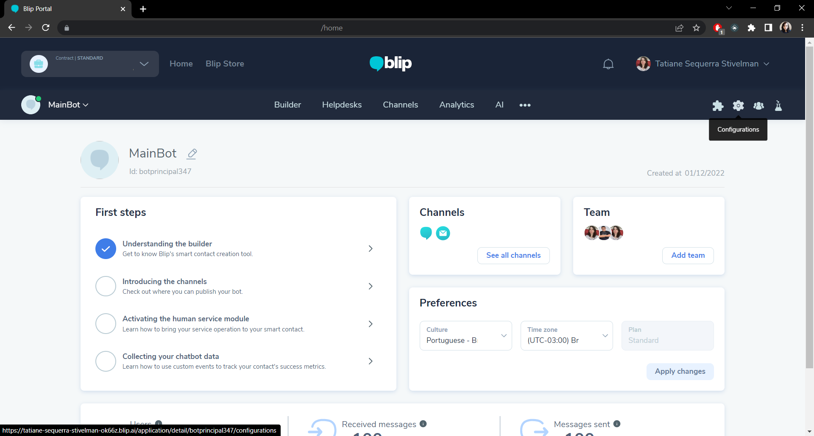
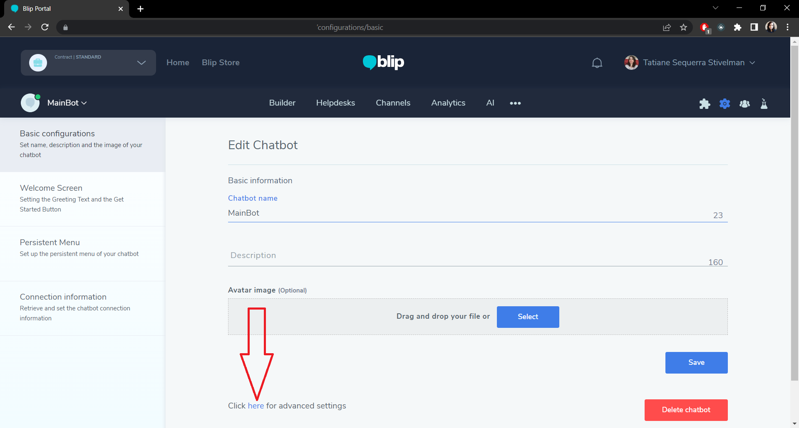
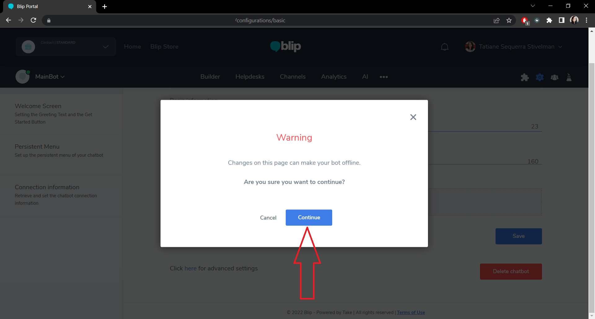
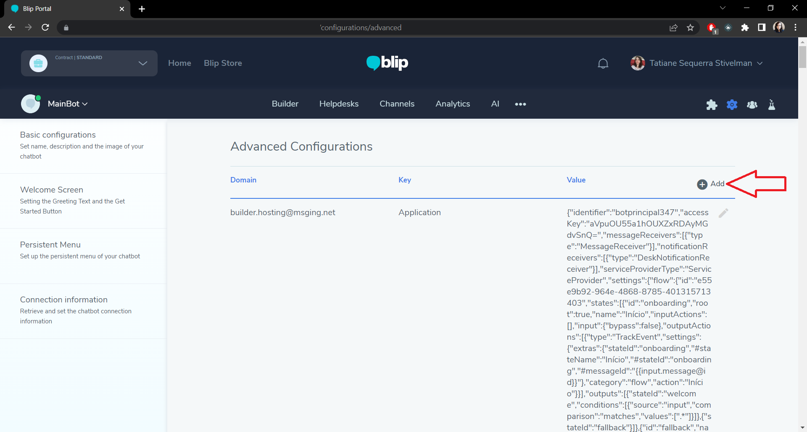
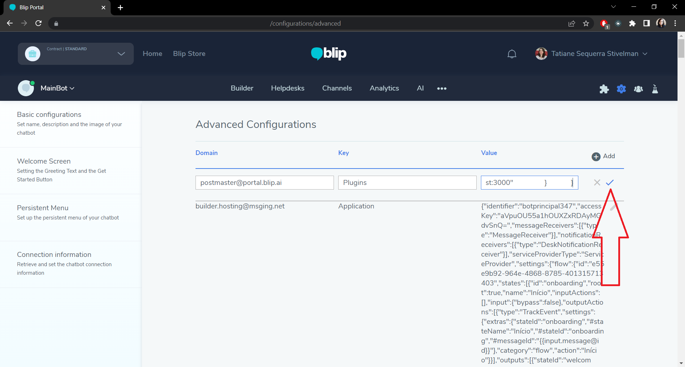
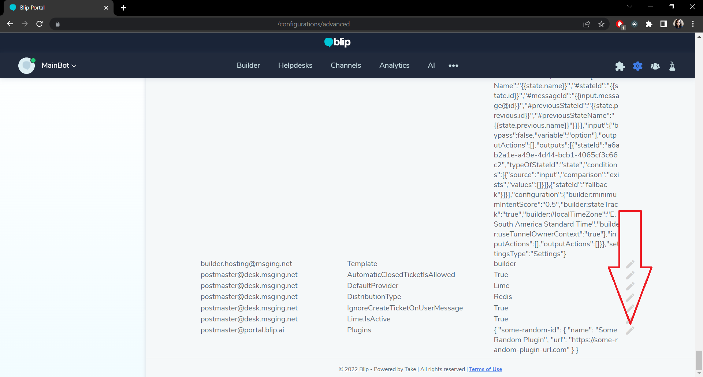
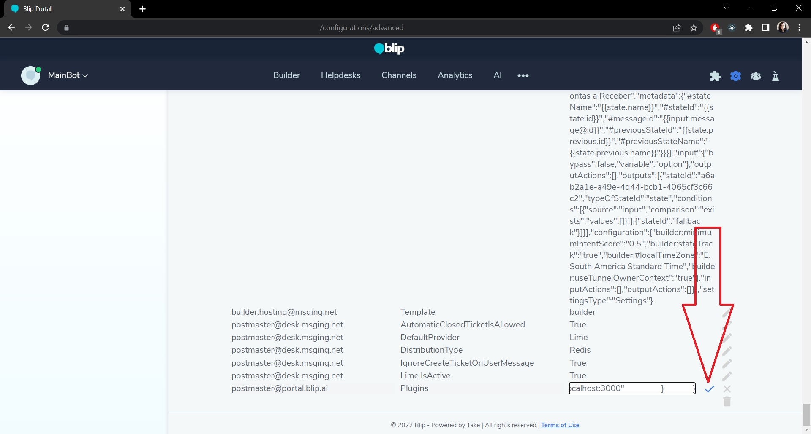
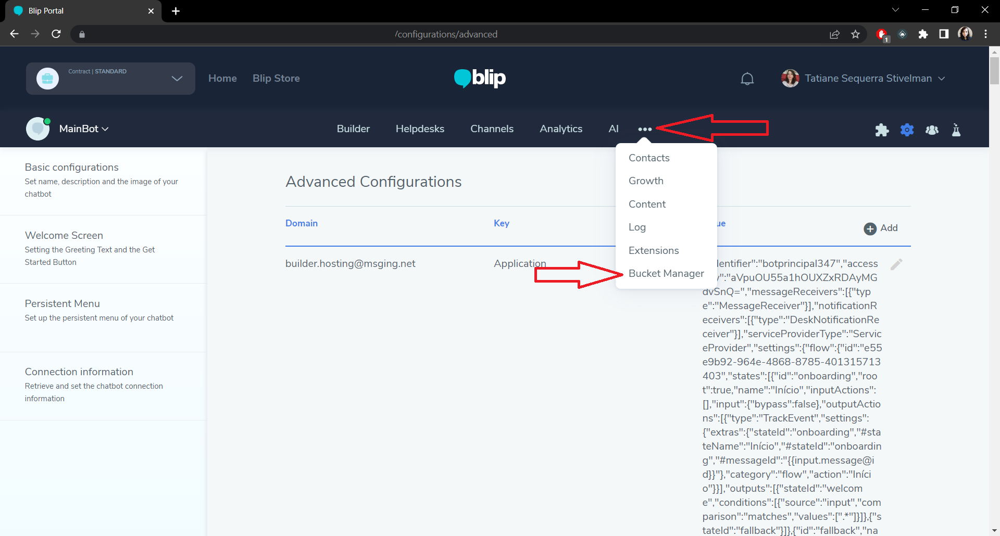

# How to install the plugin at Blip

1. Go to your bot configurations.

    

2. Go to advanced settings.

    

3. Click on 'Continue'.

    

4. Add the plugin to the bot:

    - If a configuration with domain `postmaster@portal.blip.ai` and key `Plugins` doesn't exists:
       
        1. Create a new configuration, clicking in 'Add'
            
            
        
        2. Put the following JSON in the "Value" field:
            ```
            {
                "bucket-manager": 
                {
                    "name": "Bucket Manager",
                    "url": "https://bucket.dawntech.dev/"
                }
            }
            ``` 

        3. Now click on the check icon.

            
    
    - If a configuration with domain `postmaster@portal.blip.ai` and key `Plugins` already exists: 
      
        1. Click on the edit icon.

            

        2. If before the value of this configuration was:
            ```
            {
                "some-random-id": {
                    "name": "Some Random Plugin",
                    "url": "https://some-random-plugin-url.com"
                }
            }
            ``` 

            Add the JSON values so it stays like this:
            ```
            {
                "some-random-id": {
                    "name": "Some Random Plugin",
                    "url": "https://some-random-plugin-url.com"
                },
                "bucket-manager": 
                {
                    "name": "Bucket Manager",
                    "url": "https://bucket.dawntech.dev/"
                }
            }
            ```

            And click on the check icon.

            

5. Refresh the page and find the plugin clicking on the 3 horizontal points.

    


You can find more instructions in <https://github.com/takenet/cra-template-blip-plugin/blob/main/template/README.md> at section `Now just add the plugin to your chatbot and enjoy`
