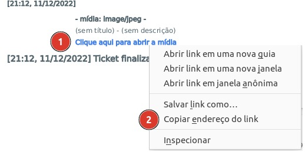
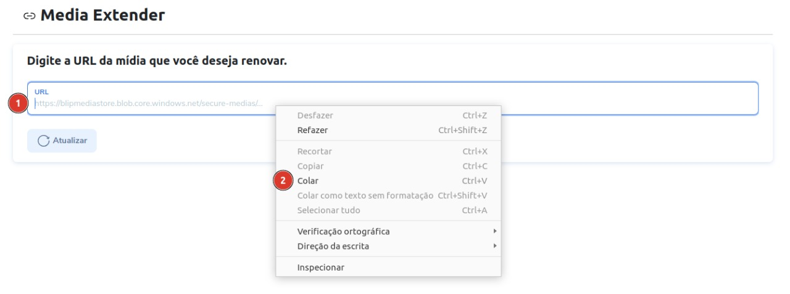
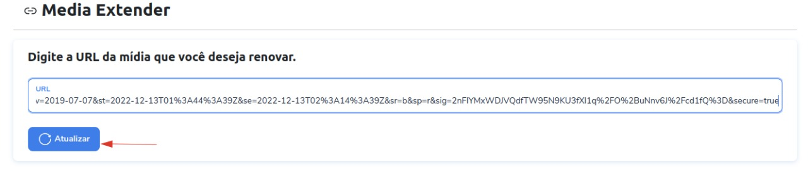

# Documentação da Extensão Media Extender
## Introdução

A extensão Media Extender foi desenvolvida pela empresa Dawntech. Atualmente, ela se encontra na versão 1.0 e está
disponível nos idiomas Português do Brasil, Espanhol e Inglês.

Este manual tem como objetivo auxiliar os usuários da plataforma Blip na instalação, configuração e utilização da extensão Media Extender. Em adendo, qualquer dúvida de uso pode ser encaminhada para [helpdesk@dawntech.dev](mailto:helpdesk@dawntech.dev) ou entrando em contato pelo número [+55 51 3557-2998](https://wa.me/555135572998).

## Sobre a extensão

As mídias são armazenadas e acessadas com links expirados. Após a data de expiração, o link de mídia fica indisponível. A extensão Media Extender foi desenvolvida para recuperar uma url nova e válida para ver a mídia de forma amigavél.

## Instalação e configuração
Para utilizar a extensão Bling em um contato inteligente, no bot Router associado ao contrato, vá até a Blip Store e procure a extensão Media Extender na aba de Extensões. Quando o encontrar, a ative nesse mesmo bot.

1. Localize a extensão no router conforme os pontos 1 e 2 da imagem abaixo.  
2. Copie a URL da midia.  
3. Cole no input url do form.  
4. Clique em atualizar.  

### A nova url será copiada para área de transferência

Cole a url copiada na barra de endereço do navegador e acesse.  
Em caso de duvidas acesso nosso video de demonstração [vídeo de demonstração](https://www.youtube.com/watch?v=sMDrECb6TUI).

## Termos de uso

Ao instalar esta extensão você concorda com os termos de uso descritos em [dawntech.dev/privacy](https://dawntech.dev/privacy/pt), política válida também para o uso dos dados coletados coletados pelo plugin (se / quando necessário).
