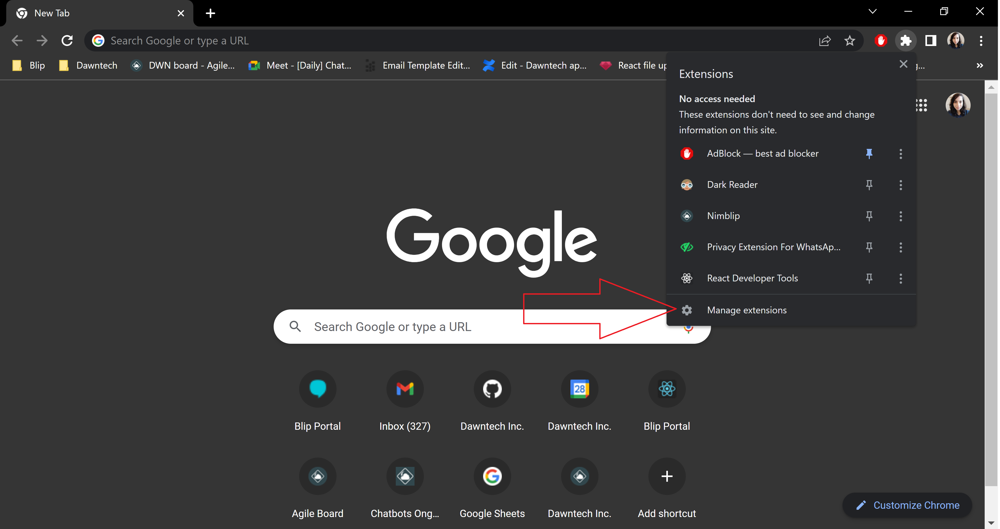
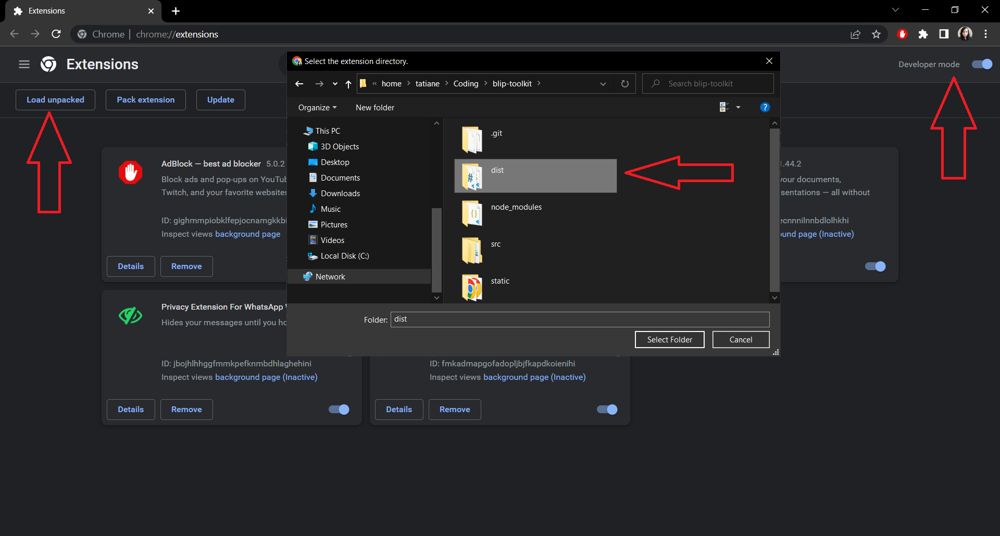
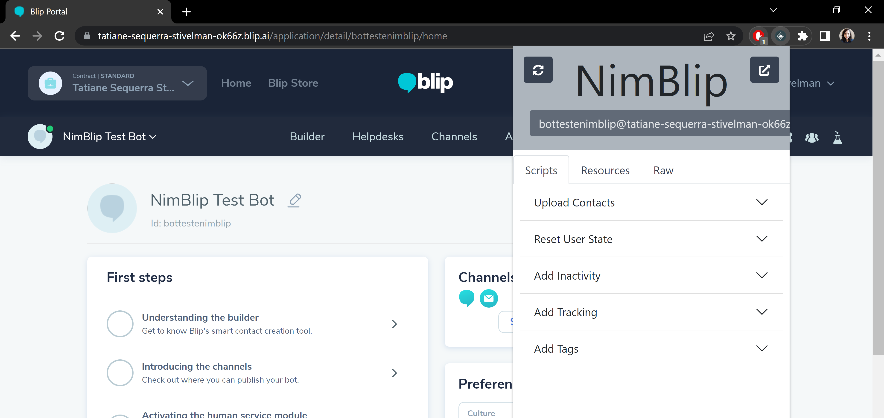

# Nimblip documentation

1. Clone the repository [blip-toolkit](https://github.com/dawntech/blip-toolkit).

2. Run `npm run build` being in the directory where `package.json` is.

3. Open Google Chrome and go to the extensions manager.

  

4. Enable developer mode, then click on 'Load unpacked' and choose the directory 'dist' inside the directory where you ran `npm run build`.

  

5. Go to any Blip bot (Nimblip will only work on these pages) and open the plugin, it will be ready to use.

  