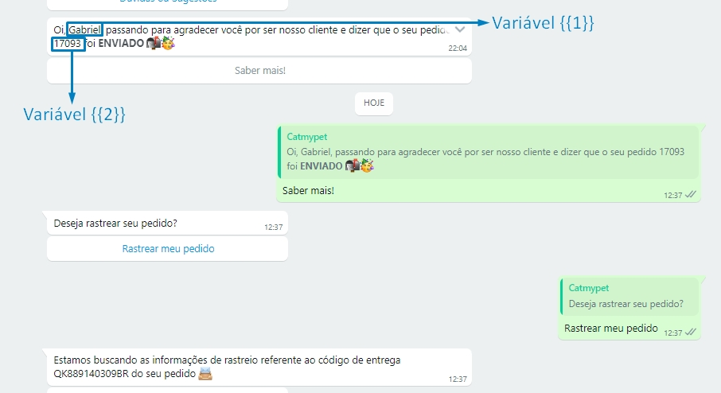

## Introdução

A extensão Bling  ERP foi desenvolvida pela empresa Dawntech. Atualmente, ela se encontra na versão 1.0 e está
disponível nos idiomas Português do Brasil, Espanhol e Inglês.

Integrando diretamente a plataforma Blip com o Bling ERP, esta extensão possibilita a atualização de status via mensagens ativas no WhatsApp e o salvamento de informações variadas nos contatos do Blip a cada mudança de status monitorado no Bling.

Este manual tem como objetivo auxiliar os usuários da plataforma Blip na instalação, configuração e utilização da extensão Bling ERP. Em adendo, qualquer dúvida de uso pode ser encaminhada para [helpdesk@dawntech.dev](mailto:helpdesk@dawntech.dev) ou entrando em contato pelo número [+55 51 3557-2998](https://wa.me/555135572998).

## Sobre a extensão

A extensão Bling ERP foi desenvolvida tendo como objetivo a integração simplificada, porém direta, entre a plataforma [Blip](https://portal.blip.ai) e o [Bling ERP](https://bling.com.br/).

As seguintes funcionalidades são oferecidas:

- Atualizações de contato.
- Notificações de status de pedido no WhatsApp.
- Eventos de sucesso e erros criados no Blip Analytics automaticamente.

## Instalação e configuração
Para utilizar a extensão Bling em um contato inteligente, no bot Router associado ao contrato, vá até a Blip Store e procure a extensão Bling na aba de Extensões. Quando o encontrar, a ative nesse mesmo bot. Após a instalação, ao abrir o bot Router, as opções de configuração da extensão Bling estarão disponíveis. Então, siga os passos a seguir:
1. Preencha as informações conforme o [vídeo de demonstração](https://www.youtube.com/watch?v=sMDrECb6TUI).

2. Copie a URL de webhook.

3. Acesse as Configurações de Integrações do Bling em [www.bling.com.br/configuracoes.integracoes.lojas.virtuais.php#list](https://www.bling.com.br/configuracoes.integracoes.lojas.virtuais.php#list).
4. Em "Pesquise por uma plataforma ou marketplace", busque por "API", e adicione a "bling API", conforme screenshot abaixo:

5. Abra a opção de configuração de integrações e vá na opção “Callbacks”.
6. Em "Tipo de retorno no callback", selecione a opção "JSON".
7. Ative a opção "Callback de pedidos de venda".
8. Cole a URL obtida na extensão no campo ativado.
9. Clique em "Salvar".

10. Ao mudar um status no pedido de venda, o usuário que possui o celular salvo no pedido recebe uma notificação no WhatsApp e é direcionado ao fluxo correspondente às configurações escolhidas.

## Propriedades para salvar nos extras dos contatos

Nas configurações da extensão, é possível selecionar até dois campos do pedido no Bling para serem salvos nas propriedades de contato do Blip.
Essas informações serão salvas em campos extras do contato, a não ser que a chave escolhida para o **Blip** seja:
- name (nome)
- taxDocument (documento)
- city (cidade)
- gender (gênero)

### Propriedades do Bling que podem ser usadas:

- desconto
- observacoes
- observacaointerna
- data
- numero
- numeroOrdemCompra
- vendedor
- valorfrete
- outrasdespesas
- totalprodutos
- totalvenda
- situacao
- dataSaida
- loja
- cliente
- pagamento
- transporte
- itens
- parcelas
- pagamento.categoria
- client.id
- client.nome
- client.cnpj
- client.ie
- client.rg
- client.endereco
- client.numero
- client.complemento
- client.cidade
- client.bairro
- client.cep
- client.uf
- client.email
- client.celular
- client.fone
- transporte.transportadora
- transporte.cnpj
- transporte.tipo_frete
- transporte.qtde_volumes

## Eventos criados a cada atualização de pedido
Esses eventos que são criados podem ser utilizados para geração de relatórios na aba de Relatórios Personalizados dentro do menu de Analytics do roteador onde a extensão está ativada:
* AtualizacoesContato
  * Valor: fone - chave: valor
* PedidosErroTrocaEstado
  * Valor: Número do pedido
* FonesErroEnvioNotificacao
  * Valor: Celular do cliente onde a notificação falhou
* PedidosErroEnvioNotificacao
  * Valor: Número do pedido onde a notificação falhou
* NotificacoesPedidos
  * Valor: Número do pedido
* NotificacoesTipo
  * Valor: Status do pedido no Bling

## Dependências

Para que a extensão funcione corretamente, é necessário uma instalação funcional do Bling ERP com a API key habilitada (conforme [ajuda.bling.com.br/hc/pt-br/articles/360035558634-Usu%C3%A1rio-e-Usu%C3%A1rio-API](https://ajuda.bling.com.br/hc/pt-br/articles/360035558634-Usu%C3%A1rio-e-Usu%C3%A1rio-API#h_9ab0c0af-fa03-4c1b-acfe-a0b9fef8ae05)).

Além disso, o campo "Celular" deve estar sempre presente dentro do campo "Cliente" dos pedidos, e deve conter apenas o DDD e o número de celular (WhatsApp).

## Termos de uso

Ao instalar esta extensão você concorda com os termos de uso descritos em [dawntech.dev/privacy](https://dawntech.dev/privacy/pt), política válida também para o uso dos dados coletados coletados pelo plugin (se / quando necessário).

## SLA

O SLA dessa e outras extensões da Dawntech Inc. podem ser acessados em [status.dawntech.dev](https://status.dawntech.dev).