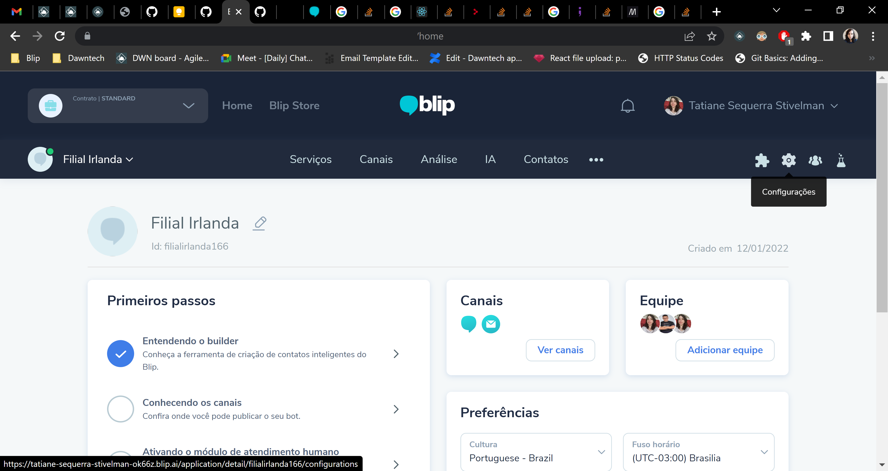
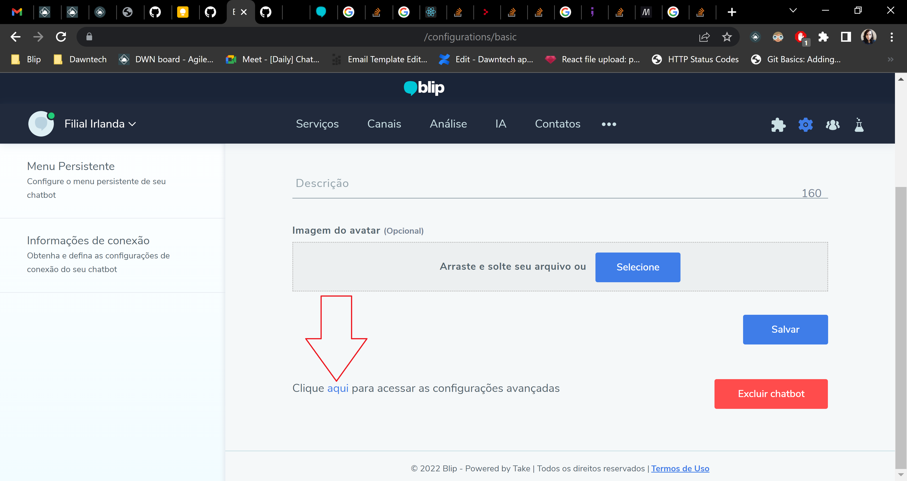
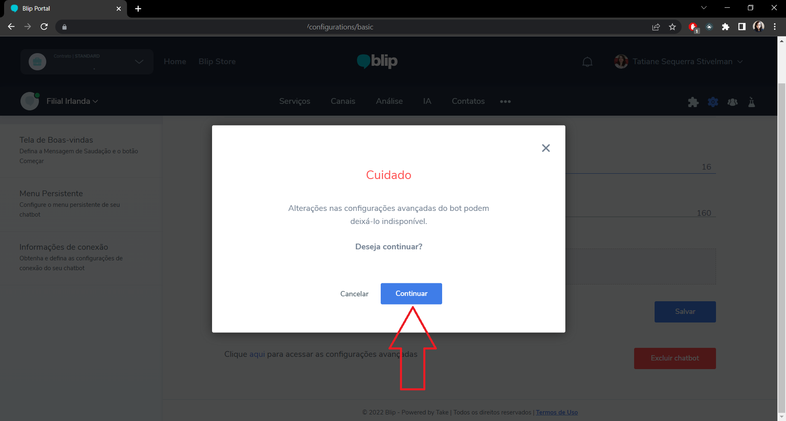
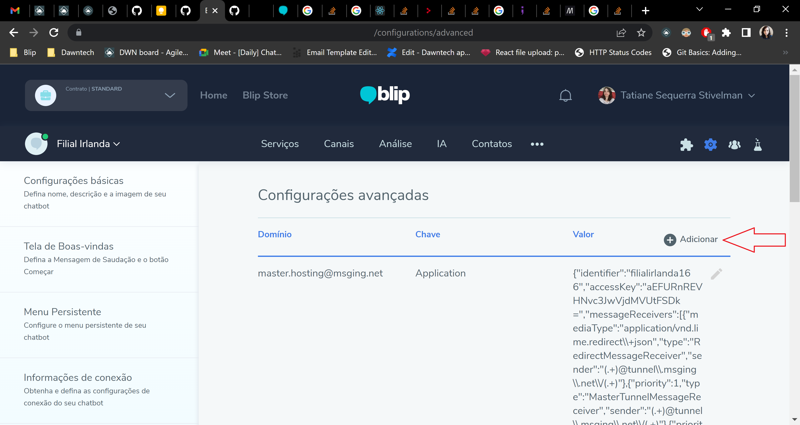
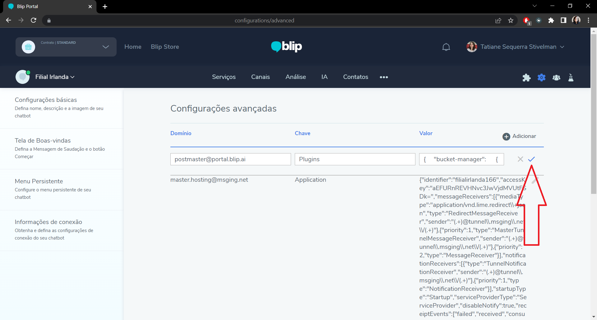
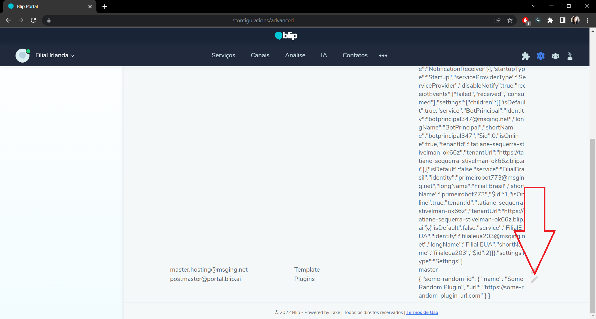
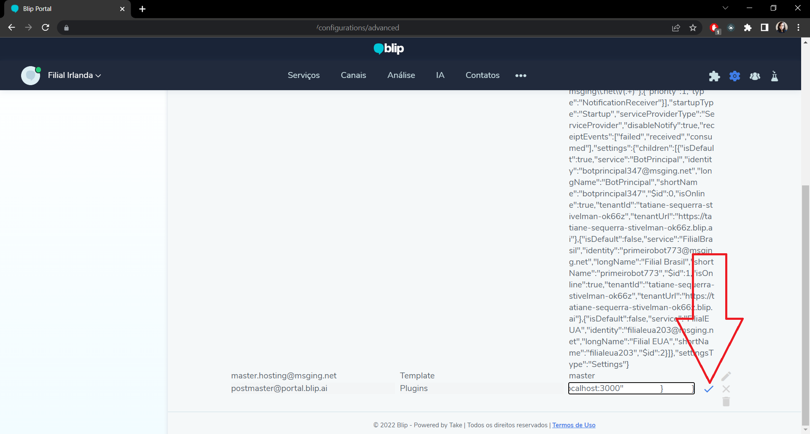
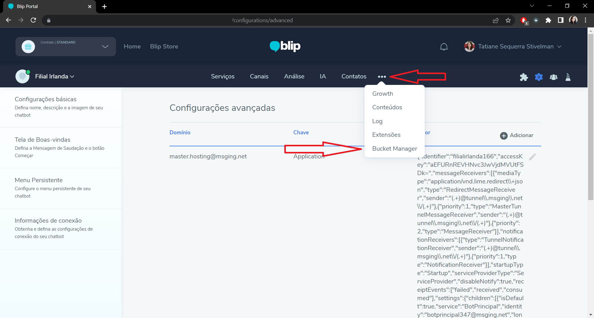

# Como instalar o plugin no Blip

1. Vá nas configurações do bot.

    

2. Vá nas configurações avançadas.

    

3. Clique em 'Continuar'.

    

4. Adicione o plugin no bot:

    - Se não existir uma configuração com domínio `postmaster@portal.blip.ai` e chave `Plugins`:
       
        1. Crie uma configuração nova, clicando em 'Adicionar'
            
            
        
        2. Coloque no campo 'Valor' o seguinte JSON:
            ```
            {
                "bucket-manager": 
                {
                    "name": "Bucket Manager",
                    "url": "https://bucket.dawntech.dev/"
                }
            }
            ``` 

        3. Agora clique no ícone de check.

            
    
    - Se já existir uma configuração com domínio `postmaster@portal.blip.ai` e chave `Plugins`: 
      
        1. Clique no ícone de edição

            

        2. Se o valor dessa configuração antes era:
            ```
            {
                "some-random-id": {
                    "name": "Some Random Plugin",
                    "url": "https://some-random-plugin-url.com"
                }
            }
            ``` 

            Adicione os valores do JSON para que fique assim:
            ```
            {
                "some-random-id": {
                    "name": "Some Random Plugin",
                    "url": "https://some-random-plugin-url.com"
                },
                "bucket-manager": 
                {
                    "name": "Bucket Manager",
                    "url": "https://bucket.dawntech.dev/"
                }
            }
            ```

            E clique no ícone de check.

            

5. Atualize a página e clique nos 3 pontos horizontais para achar o plugin

    


Você pode achar mais instruções em <https://github.com/takenet/cra-template-blip-plugin/blob/main/template/README.md> na seção `Now just add the plugin to your chatbot and enjoy`
