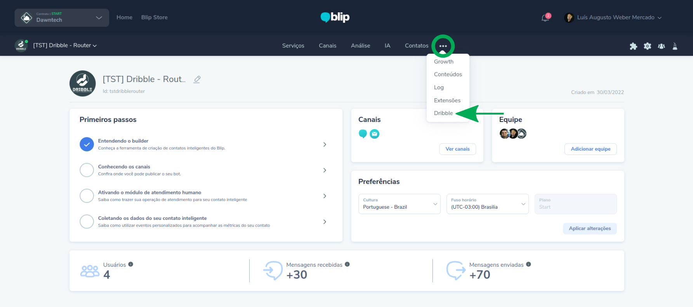
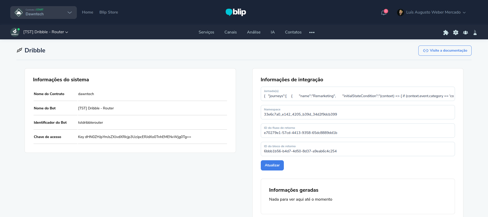
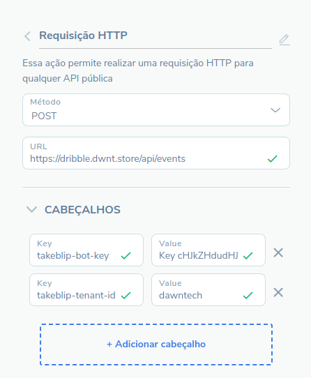

## Introdução

A extensão Dribble foi desenvolvida pela empresa Dawntech Inc. Atualmente, ela se encontra na versão 1.0 e está disponível nos idiomas Português do Brasil e Inglês. Com essa extensão, o usuário pode programar Jornadas com ações pré-determinadas (incluindo o envio de mensagens ativas) e acompanhar o desenvolvimento dos clientes dentro da(s) mesma(s). 

Este manual tem como objetivo auxiliar os usuários da plataforma Blip na instalação, configuração e utilização da extensão Dribble. Em adendo, qualquer dúvida de uso pode ser encaminhada para contact@dawntech.dev ou entrando em contato pelo número (51) 3557-2998.
Sobre a extensão

A extensão Dribble foi desenvolvida tendo como o objetivo a associação de um fluxo do Builder com uma Jornada, para tomar ações pré-determinadas e/ou acompanhar o status do cliente, de maneira totalmente personalizável.

As seguintes funcionalidades são oferecidas:
- Criação de diversas Jornadas;
- Agendamentos de ações do tipo:
- Notificações (mensagens ativas);
- Alterações de dados do contato;
- Chamadas HTTP do tipo GET ou POST.
- Acompanhamento de Estado na Jornada por contato.

Além disso, prevemos as seguintes evoluções:
- Melhorias de diversos aspectos visuais na tela de configuração da extensão;
- Adicionar os dados relativos ao Estado na Jornada do contato diretamente nas informações extras do contato;
- Integração direta com a API de eventos do Blip.


## Instalação e configuração

Para utilizar a extensão Dribble, no bot Router associado ao contrato, vá até a BlipStore e procure a extensão Dribble na aba de Extensões. Quando o encontrar, o ative nesse mesmo bot. Após a instalação, ao abrir o bot Router, as opções de configuração da extensão Dribble  estarão disponíveis  seguindo os passos mostrados na Figura 1. A tela de configuração da extensão é mostrada na Figura 2.

|  | 
|:--:| 
| **Figura 1**: Acesso a página de configuração da extensão. |

A configuração de Jornada, configuração mais importante desta extensão, mostrada na Figura 2, será explicada na próxima seção deste documento.

|  | 
|:--:| 
| **Figura 2**: Tela de configuração do Dribble. |


## Manual de uso por perfil

Usuários com permissão de administrador podem alterar as informações de configuração da extensão, além de adicionar ao Builder chamadas HTTP específicas para a extensão, que utiliza as configurações supracitadas.
Para utilizar os recursos da extensão, é necessário configurar uma ação do tipo Requisição HTTP chamando a URL `https://dribble.dwnt.store/api/{recurso}` com dois Cabeçalhos HTTP: **takeblip-bot-key** e **takeblip-tenant-id**, sendo a chave de acesso do bot onde a extensão foi instalada (bot Router) e o nome do contrato, respectivamente (conforme ilustrado na Figura 3), onde `{recurso}` deve ser substituído por um dos endpoints HTTP citados abaixo.
A extensão provê dois endpoints HTTP:

- Criação de eventos (POST):
  - URL: `https://dribble.dwnt.store/api/events`
  - Corpo (JSON):
  
    ```json
    {
      "authorId": "{contact.identity}",
      "category": "{categoria}",
      "action": "{ação}",
      "extras": {}
    }
    ```

Consulta do Estado da Jornada de um contato (GET):

- URL: `https://dribble.dwnt.store/api/contacts/{contact.identity}`

|  | 
|:--:| 
| **Figura 3**: Chamada do tipo Requisição HTTP no Blip para o Dribble. |


### Configurando Jornadas

As Jornadas devem ter um início e podem ou não ter um fim, sendo o segundo caso uma Jornada Cíclica. Uma Jornada engloba Estados e a transição entre os mesmos, onde cada Estado pode possuir ações a serem executadas ao entrar e/ou ao sair deste de maneira condicional ou não. Tomando como exemplo uma Jornada de remarketing, descrita da seguinte forma:

> Um cliente, ao entrar na loja virtual, pode comprar ou não comprar um produto. Caso ele realize uma compra, envie uma notificação daqui duas semanas para o seu número de WhatsApp com uma promoção para que o mesmo volte a comprar, além de uma mensagem de agradecimento assim que o usuário comprar algum item.

No contexto de assistentes virtuais, podemos ter um chatbot que apresente um catálogo em que o cliente seleciona os produtos e finaliza ou não o pedido. A Jornada de Remarketing, apresentada acima, pode ser modelada de maneira cíclica da seguinte forma:

- **Três Estados**: *Escolhendo*, *Comprou* e *Não-comprou*;
- **Um estado que inicia a Jornada**: *Escolhendo*;
- **Quatro Transições de Estado**: (1) *Escolhendo* → *Comprou*; (2) *Escolhendo* → *Não-comprou*; E, após ter comprado ou não, (3) *Comprou* → *Escolhendo* e (4) *Não-comprou* → *Escolhendo*, respectivamente:
  - Estas transições são baseadas em eventos, que possuem o formato `{categoria}:{ação}`: Neste exemplo, `compra:iniciada`, `compra:finalizada` e `compra:cancelada`. Ao reconhecer o evento `compra:iniciada`, o cliente entra no estado Escolhendo. Se evento `compra:finalizada` acontecer a transição (1) é feita, e caso aconteça o evento `compra:cancelada`, a transição (2). Novamente, ao reconhecer o evento `compra:iniciada` a transição (3) ou (4) é realizada, dependendo do Estado atual do cliente na Jornada.
- **Duas ações de entrada no Estado Comprou**: (1) Enviar uma notificação instantânea com um template de mensagem pré-definido e (2) Enviar uma notificação daqui duas semanas, também com um template de mensagem pré-definido.


É necessário também definir uma condição que determine o início do cliente em na jornada. Para que o Dribble compreenda essa Jornada, é necessário estruturar a mesma. Usando o formato JSON, podemos adicionar essa Jornada de Remarketing ao Dribble para acompanhar o seus clientes usando a seguinte estrutura:

```json
{
  "journeys":[
    {
      "name":"Remarketing",
      "initialStateCondition":"(context) => { if (context.event.category == 'compra' && context.event.action == 'iniciada') { return 'escolhendo'; } }",
      "flow":[
        {
          "id":"escolhendo",
          "transitions":[
            {
              "to":"comprou",
              "condition":"(context) => { return context.event.category == 'compra' && context.event.action == 'feita'; }"
            },
            {
              "to":"não-comprou",
              "condition":"(context) => { return context.event.category == 'compra' && context.event.action == 'cancelada'; }"
            }
          ],
          "onEnterActions":[],
          "onLeaveActions":[]
        },
        {
          "id":"comprou",
          "transitions":[
            {
              "to":"escolhendo",
              "condition":"(context) => { return context.event.category == 'compra' && context.event.action == 'iniciada'; }"
            }
          ],
          "onEnterActions":[
            {
              "type":"send-notification",
              "template":"dribble_mensagem1",
              "values":[]
            },
            {
              "type":"send-notification",
              "Delay":336, // Duas semanas em horas
              "template":"dribble_mensagem2",
              "values":[]
            }
          ],
          "onLeaveActions":[]
        },
        {
          "id":"não-comprou",
          "transitions":[
            {
              "to":"escolhendo",
              "condition":"(context) => { return context.event.category == 'compra' && context.event.action == 'iniciada'; }"
            }
          ],
          "onEnterActions":[],
          "onLeaveActions":[]
        }
      ]
    }
  ]
}
```

Para cada tipo de ação, é possível configurar duas propriedades: *condition* e *delay*. A primeira define a condição necessária para que uma ação execute (podendo ser tanto com base nas informações do contato ou a de um evento recebido) e a segunda o tempo para que esta ação seja executada, definida em horas. Além das ações de envio de notificação, é possível configurar as seguintes ações, com as opções de condition e delay sendo opcionais:

- Chamada HTTP do tipo GET:
  ```json
  {
      "type": "http",
      "method": "get",
      "url": "https://dawntech.dev",
      "headers": [
        // ...
      ]
  }
  ```

- Chamada HTTP do tipo POST:
  ```json
  {
      "type": "http",
      "method": "post",
      "url": "https://dawntech.dev",
      "headers": [
        // ...
      ],
      "body": [
        // ...
      ]
  }
  ```

- Atualizar contato:
  ```json
  {
    "type": "update-contact",
      "data": {
        "name": "...",
        // ...
      }
  }
  ```


## Termos de Uso

Ao instalar esta extensão você concorda com os termos de uso descritos em https://dawntech.dev/privacy, política válida também para o uso dos dados coletados coletados pela extensão (se/quando necessário).


## SLA

O SLA desse e outras extensões da Dawntech Inc. podem ser acessados em https://status.dawntech.dev.
