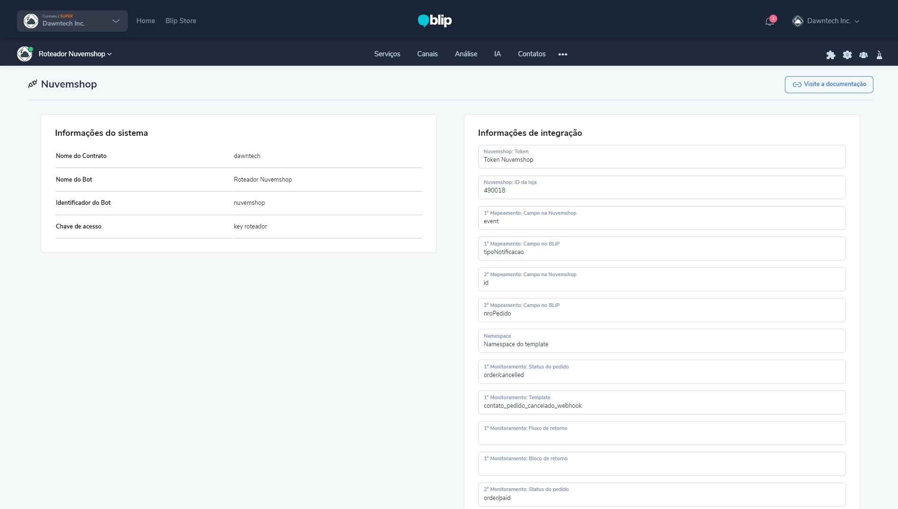
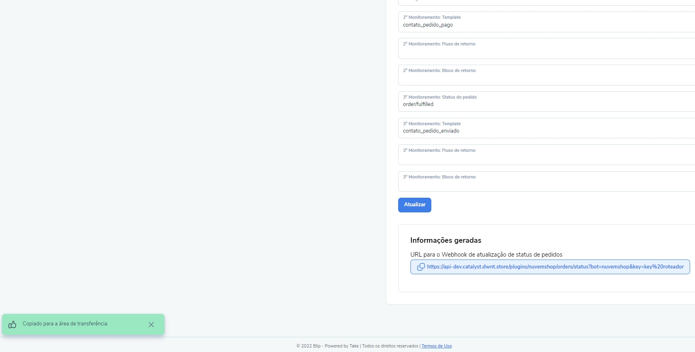
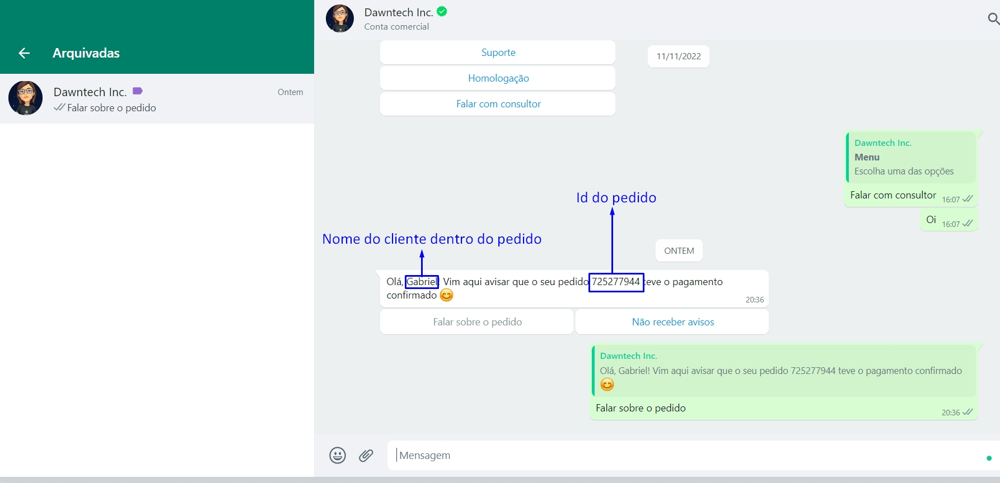

## Introdução

A extensão Nuvemshop foi desenvolvida pela empresa Dawntech Inc., e atualmente se encontra na versão 1.0. A extensão está disponível nos idiomas Português do Brasil, Espanhol e Inglês.

Integrando diretamente a plataforma Blip com a Nuvemshop, essa extensão possibilita a atualização de status via mensagens ativas no WhatsApp e o salvamento de informações variadas nos contatos do Blip, a cada mudança de status monitorado na Nuvemshop.

Este manual tem como objetivo auxiliar os usuários da plataforma Blip na instalação, configuração e utilização da extensão Nuvemshop. Em adendo, qualquer dúvida de uso pode ser encaminhada para [helpdesk@dawntech.dev](mailto:helpdesk@dawntech.dev) ou entrando em contato pelo número [+55 51 3557-2998](https://wa.me/555135572998).

## Sobre a extensão

A extensão Nuvemshop foi desenvolvida tendo como objetivo a integração simplificada, porém direta, entre a plataforma [Blip](https://portal.blip.ai) e a plataforma [Nuvemshop](https://www.nuvemshop.com.br).

As seguintes funcionalidades são oferecidas:

- Atualizações de contato.
- Atualização de status de pedido no WhatsApp.
- Eventos de sucesso e erros criados no Blip Analytics automaticamente.

## Instalação e configuração

Para utilizar a extensão Nuvemshop em um contato inteligente, no bot Router associado ao contrato, vá até a Blip Store e procure a extensão Nuvemshop na aba de Extensões. Quando o encontrar, a ative nesse mesmo bot. Após a instalação, ao abrir o bot Router, as opções de configuração da extensão Nuvemshop estarão disponíveis. Então, siga os passos a seguir:
1. Preencha as informações conforme o [vídeo de demonstração](https://www.youtube.com/watch?v=ontlU0CweBE).

2. Copie a URL de webhook na parte inferior das configurações da extensão.

3. Acesse a documentação da API de integração da Nuvemshop em [https://tiendanube.github.io/api-documentation/intro](https://tiendanube.github.io/api-documentation/intro).
4. Em “API Resources” vá até a sessão de “Webhooks”. Ali será explicado como criar um webhook e como adicionar a URL copiada no primeiro passo (no [vídeo](https://www.youtube.com/watch?v=ontlU0CweBE) é apresentado como fazer isso na API da Nuvemshop).
5. Cada status de pedido deve ter um webhook cadastrado.
6.  Ao mudar um status no pedido, o usuário que possui o celular salvo no pedido recebe uma notificação no WhatsApp e é direcionado ao fluxo correspondente às configurações escolhidas.

## Propriedades da Nuvemshop que podem ser usadas:

- event
- store_id
- contact_email
- contact_name
- contact_phone
- contact_identification
- shipping_min_days
- shipping_max_days
- billing_name
- billing_phone
- billing_address
- billing_number
- billing_floor
- billing_locality
- billing_zipcode
- billing_city
- billing_province
- billing_country
- shipping_cost_owner
- shipping_cost_customer
- subtotal
- discount
- discount_coupon
- discount_gateway
- total
- total_usd
- checkout_enabled
- weight
- currency
- language
- gateway
- gateway_id
- gateway_name
- shipping
- shipping_option
- shipping_option_code
- shipping_option_reference
- shipping_pickup_details
- shipping_tracking_number
- shipping_tracking_url
- shipping_store_branch_name
- shipping_pickup_type
- shipping_suboption
- payment_details.method
- payment_details.credit_card_company
- payment_details.installments
- customer.id
- customer.name
- customer.email
- customer.identification
- customer.phone
- customer.note
- customer.default_address
- products
- shipping_status
- shipped_at
- paid_at
- landing_url
- client_details.browser_ip
- client_details.user_agent

## Eventos criados a cada atualização de pedido
Esses eventos que são criados podem ser utilizados para geração de relatórios na aba de Relatórios Personalizados dentro do menu de Analytics do roteador onde a extensão está ativada:
* AtualizacoesContato
  * Valor: fone - chave: valor
* PedidosErroTrocaEstado
  * Valor: Número do pedido
* FonesErroEnvioNotificacao
  * Valor: Celular do cliente onde a notificação falhou
* PedidosErroEnvioNotificacao
  * Valor: Número do pedido onde a notificação falhou
* NotificacoesPedidos
  * Valor: Número do pedido
* NotificacoesTipo
  * Valor: Status do pedido na Nuvemshop

## Dependências

Para que a extensão funcione corretamente, é necessária a criação e configuração de um aplicativo na loja, para que se obtenha a API key e a store_id para a criação do webhook utilizado por essa extenção (documentação no [link](https://atendimento.nuvemshop.com.br/pt_BR/parceiros-tecnologicos/como-fazer-um-aplicativo-para-a-loja-de-aplicativos-nuvemshop)).

Além disso, o campo “contact_phone” deve estar sempre presente dentro do pedido, e deve conter apenas o DDD e o número de celular (WhatsApp).

## Termos de uso

Ao instalar esta extensão você concorda com os termos de uso descritos em [dawntech.dev/privacy](https://dawntech.dev/privacy/pt), política válida também para o uso dos dados coletados coletados pelo plugin (se / quando necessário).

## SLA

O SLA dessa e outras extensões da Dawntech Inc. podem ser acessados em [status.dawntech.dev](https://status.dawntech.dev).