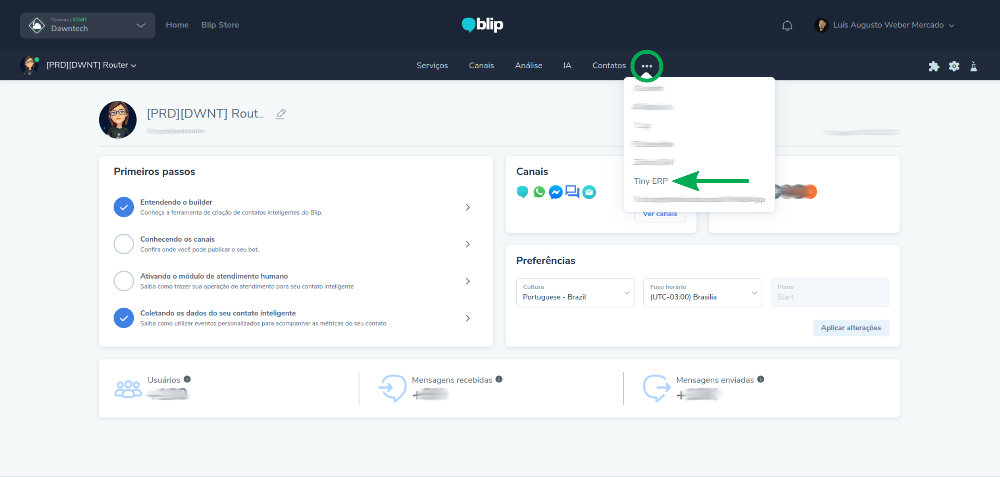
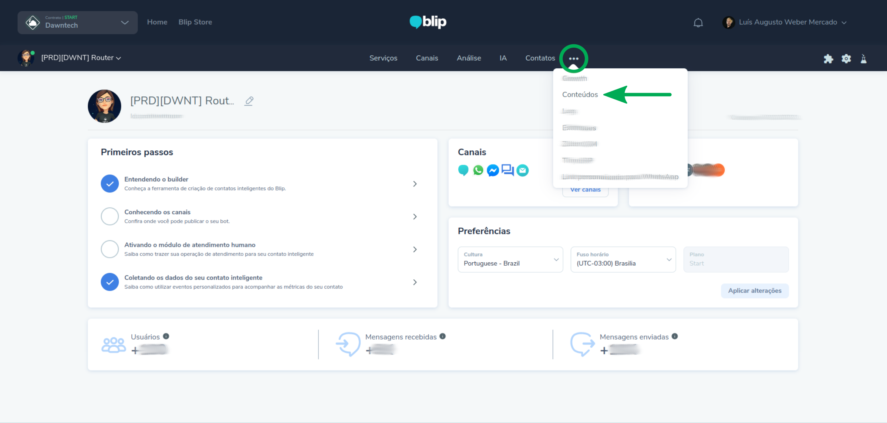
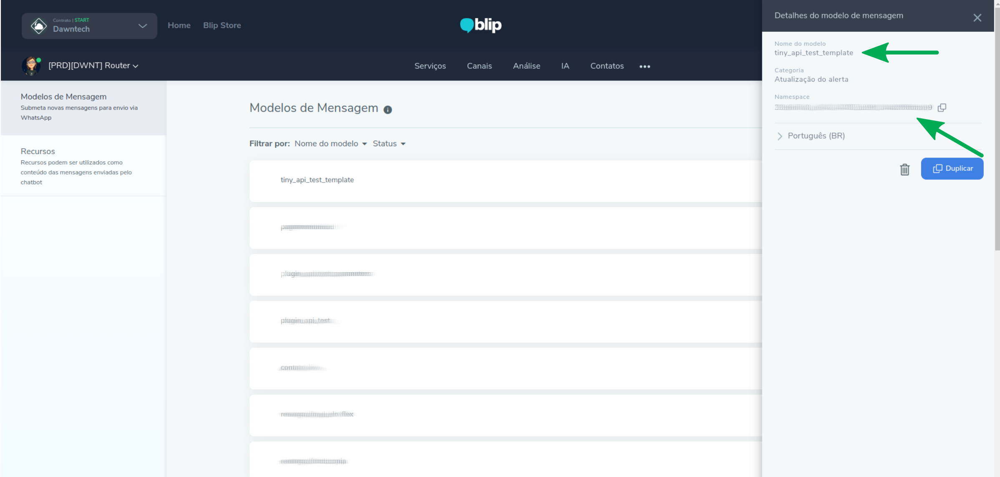
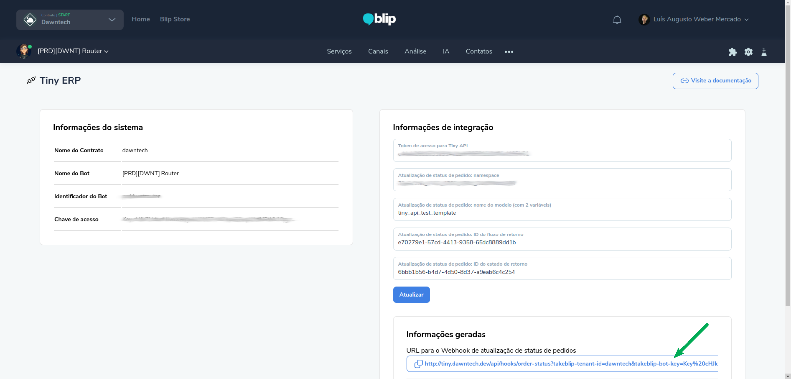
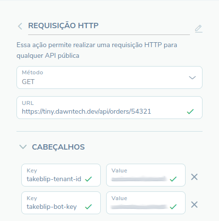

## Introdução

A extensão Tiny ERP foi desenvolvida pela empresa Dawntech. Atualmente, ela se encontra na versão 1.0 e está
disponível nos idiomas Português do Brasil, Espanhol e Inglês.

Integrando diretamente a plataforma Blip com o Tiny ERP, esta extensão possibilita a consulta de pedidos e seus detalhes por meio do número do pedido ou pelo documento associado com a(s) compra(s). Também é possível configurar o envio de notificações automáticas quando há alteração no *status* do pedido.

Este manual tem como objetivo auxiliar os usuários da plataforma Blip na instalação, configuração e utilização da extensão Tiny ERP. Em adendo, qualquer dúvida de uso pode ser encaminhada para helpdesk@dawntech.dev ou entrando em contato pelo número +55 51 3557-2998.


## Sobre a extensão

A extensão Tiny ERP foi desenvolvida tendo como objetivo a integração simplificada, porém direta, entre a plataforma Blip e o ERP Tiny.
As seguintes funcionalidades são oferecidas:

- Listagem de pedidos baseado no documento (CPF/CNPJ);
- Consulta de detalhes dos pedidos por meio do número do pedido;
- Envio automático de notificações quando há alteração no *status* do pedido.

Além disso, prevemos as seguintes evoluções:

- Gerenciamento de Leads;
- Campos específicos para ID do Fluxo e ID do Estado com opções pré-carregadas;
- Possibilitar o uso de modelos de mensagens com diferentes números de variáveis para as notificações, assim como a definição de variáveis que podem ser utilizadas.


## Instalação e configuração

Ao ativar a extensão pela Blip Store, ela deverá ser instalada no bot Router. Após sua ativação, você deverá configurar o plugin com o token de acesso a API do Tiny ERP que é específica do cliente, e, portanto, o mesmo deve ser compartilhado pelo contratante. As instruções para a geração desse token de acesso podem ser acessadas em https://tiny.com.br/api-docs/api2-gerar-token-api.

Para configurar o plugin, é necessário acessar o bot Router. Na rela inicial do Router, no cabeçalho, clicar em "..." (ao lado da opção Contatos) e acessar Tiny ERP, como ilustrado na figura abaixo (Figura 1).

|  | 
|:--:| 
| **Figura 1**: Como acessar as configurações do plugin. |

Além de informar o token, é possível configurar os campos relativos as notificações automáticas, por meio dos dampos prefixados com *Atualização de status de pedido*: *namespace*, nome do modelo, ID do fluxo e do estado de retorno do usuário após receber a notificação. O *namespace* e nome do modelo são obtidos consultando a página de Conteúdos do bot Router (clicar em "...", ao lado da opção Contatos) e em seguida "Modelos de Mensagens" (Figura 2 e 3).

|  | 
|:--:| 
| **Figura 2**: Como acessar os templates de mensagens. |

|  | 
|:--:| 
| **Figura 3**: Exemplo de template de mensagem e as informações necessárias para configurar a extensão. |

Após a configuração inicial dos parâmetros, é necessário uma última configuração dentro do Tiny ERP. É necessário que o webhook de **Atualizações de situação de pedido** seja configurado utilizando a URL gerada na mesma tela de configuração, na seção *Informações geradas*. Basta clicar no botão com a URL (Figura 4) e seguir as instruções disponíveis em https://www.tiny.com.br/api-docs/api2-webhooks-atualizacao-situacao-pedido.

|  | 
|:--:| 
| **Figura 4**: O link para configuração do Webhook no Tiny é gerado dinamicamente. |


## Manual de uso por perfil

Usuários com permissão de administrador conseguem alterar as informações de configuração da extensão, além de adicionar ao Builder chamadas específicas para o plugin, que utiliza as configurações supracitadas. Para isso, é necessário configurar uma ação de Requisição HTTP chamando a URL https://tiny.dawntech.dev/api/<recurso> com dois Cabeçalhos HTTP: **takeblip-bot-key** e **takeblip-tenant-id**, sendo a chave de acesso do bot onde a extensão foi instalada e o nome do contrato, respectivamente (conforme ilustrado na Figura 5).

|  | 
|:--:| 
| **Figura 5**: Exemplo de requisição HTTP no Builder. |

Na URL https://tiny.dawntech.dev/api/<recurso>, <recurso> se refere a operação realizada pela API: listar pedidos do usuário por documento, consultar pedido pelo número do pedido e notificar usuário sobre alteração no status do pedido. Abaixo, são listadas as chamadas passíveis de serem usadas por meio da ação de Requisição HTTP (que também podem ser testadas via Swagger UI disponível no link https://tiny.dawntech.dev/api/docs/):

### Consulta de pedido

**https://tiny.dawntech.dev/api/orders/{id}**

- Parâmetros: 
  - **{id}** é o número do pedido.
- Tipo de chamada: GET;
- Cabeçalhos:
  - **takeblip-bot-key**: chave de acesso do bot onde a extensão foi instalada;
  - **takeblip-tenant-id**: nome do contrato.
- Corpo: Indiferente;
- Tipo do retorno: JSON.

#### Exemplo de retorno

- Pedido encontrado:

  - Status HTTP: 200;
  - Body:

  ```json
  {
      "internalId": "123",
      "externalId": "54321", 
      "clientDocument": "123.456.789-10",
      "clientPhone": "(51) 987654321",
      "clientName": "João Maria da Silva",
      "status": "Enviado",
      "tracking": {
          "company": "Correios",
          "code": "SL123456789BR",
          "url": "https://exemplo.rastreamento.correios.com.br/"
      }
  }
  ```

  ou (quando **não há** informações de rastreamento disponível):

  ```json
  {
      "internalId": "123",
      "externalId": "54321", 
      "clientDocument": "123.456.789-10",
      "clientPhone": "(51) 987654321",
      "clientName": "João Maria da Silva",
      "status": "Faturado",
      "tracking": {
          "company": "",
          "code": "",
          "url": ""
      }
  }
  ```

- Pedido não encontrado:
  - Status HTTP: 400.
  - Body: `{}`


### Listagem de pedidos por documento

**https://tiny.dawntech.dev/api/orders/client/{document}**

- Parâmetros: 
  - **{document}** é o documento do cliente que pode ou não estar associado a um (ou mais) pedidos.
- Tipo de chamada: **GET**;
- Cabeçalhos:
  - **takeblip-bot-key**: chave de acesso do bot onde a extensão foi instalada;
  - **takeblip-tenant-id**: nome do contrato.
- Corpo: Indiferente;
- Tipo do retorno: JSON.

#### Exemplo de retorno

- Pedidos encontrados:

  ```json
  [
      {
          "internalId": "124",
          "externalId": "54322", 
          "clientDocument": "123.456.789-10",
          "clientPhone": "(51) 987654321",
          "clientName": "João Maria da Silva",
          "status": "Enviado",
          "tracking": {
              "company": "Correios",
              "code": "SL123456789BR",
              "url": "https://exemplo.rastreamento.correios.com.br/"
          }
      },
      {
          "internalId": "123",
          "externalId": "54321", 
          "clientDocument": "123.456.789-10",
          "clientPhone": "(51) 987654321",
          "clientName": "João Maria da Silva",
          "status": "Finalizado",
          "tracking": {
              "company": "Correios",
              "code": "SL123456790BR",
              "url": "https://exemplo.rastreamento.correios.com.br/"
          }
      }
  ]
  ```

  

- Pedidos não encontrados:

  - Status HTTP: 400.
  - Body: `[]`


## Dependências

Para que a extensão funcione corretamente, é necessário uma instalação funcional do Tiny ERP com a extensão Token API habilitada (conforme [https://tiny.com.br/api-docs/api2-gerar-token-api](https://tiny.com.br/api-docs/api2-gerar-token-api)).


## Termos de uso

Ao instalar esta extensão você concorda com os termos de uso descritos em [https://dawntech.dev/privacy](https://dawntech.dev/privacy), política válida também para o uso dos dados coletados coletados aqui (se necessário).
